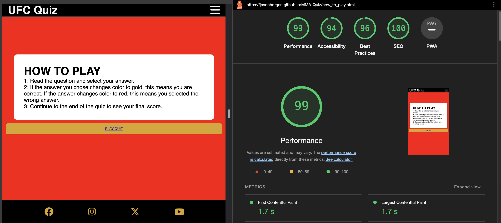
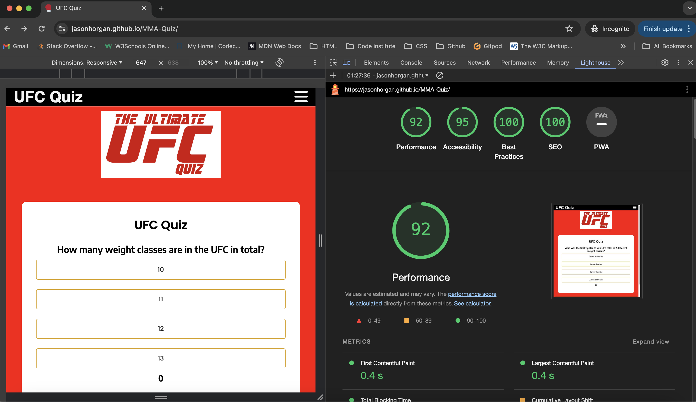

# Project Portfolio 2 - UFC Quiz

This UFC Quiz is a multiple choice quiz for MMA fans to test their UFC knowledge  

[You can view my website here](https://jasonhorgan.github.io/MMA-Quiz/)

# User Experience (UX)

### Initial Discussion

This page is a UFC quiz for MMA fans to test their knowledge  

#### Key information for the site

- UFC knowledge quiz
- How to play section
- Username ???
- Color scheme that UFC fans will be immediately familliar with 

### User Stories

#### Client Goals

- To make it easy for users to know how to play the quiz
- To create an inviting quiz that people want to try over again until they get 10/10 score
- Make it fun so people want to share it with their friends so they can compare scores with each other 
- 

#### First Time Visitor Goals

- Have fun playing a quiz testing their UFC knowledge 

#### Returning Visitor Goals

- I want to beat my previous high score and see new questions

#### Frequent Visitor Goals

- I want to test my knowledge of updated stats

## Design

### Color Scheme

The website uses a color scheme of Red, white and black which are the colours of the UFC branding. People familiar with the UFC would immediately recognise this colour scheme. I also highlighted some parts of the site in gold which is used to represent UFC gold championship belts. 

### Imagery 

Images were used with the permission of the owners and taken from royalty free sites. 

### Wireframe 

The Wireframe was created using Balsamiq 

### Features

There are two pages on this site, the home page with the quiz and another page with instructions on how the quiz works. 

When the user accesses the site, they are imediately greeted with a UFC logo and title stating it is a quiz, so the intention of the site should be immediately clear to the user.

There is also a "How to play" button so the user can find additional instructions on how the quiz works.

When the user selects an answer, the selected answer will turn gold if they got the question right, or red if they got it wrong, as indicated in the how to page. If they get the answer correct, their score will update at the bottom of the page. This continues until the user answers 10 questions and the quiz then ends and displays their score, along with a message that changes depending on the score achieved. 

### Future implementation

In the future I would like to implement a scoreboard, a modal where the rules pop up when a button is clicked so I can remove the header as I feel the header takes away from the overall feel of the webpage. 

## Deployment & Local Development

### Deployment

Github Pages was used to deploy the live website. The instructions to achieve this are below:

- Go to the Settings tab of your GitHub repo.
- On the left-hand sidebar, in the Code and automation section, select Pages.
- Make sure:
    Source is set to 'Deploy from Branch'.
    Main branch is selected.
    Folder is set to / (root).
- Under Branch, click Save.
- Go back to the Code tab. Wait a few minutes for the build to finish and refresh your repo.
- On the right-hand side, in the Environments section, click on 'github-pages'.
- Click View deployment to see the live site. The URL will look similar to YOUR-USERNAME.github.io/project-name.

## Testing

The site has been tested on a range of devices and is responsive on all size devices including phone, tablet and desktopn and other sizes using chrome developer tools .

The code has been ran through W3C CSS and HTML validator and JShint and has passed with no errors. Screenshots below.

The site and all of its pages have been tested on lighthouse and all passed.

### Bugs

I discovered a bug where the showScore function was not dispaying the correct alerts with the messages based on the score, which turned out to be beacuse I was missing a semicolan. My startQuiz function was not resetting the score to 0 either but I fixed this after speaking with mentoring services.

### Code Credits

I referenced multiple different resources as outlined below:

- Code Institute's "Love Running" walkthrough for Header, Nav bar, Footer, favicon and media query set ups. 
- Code Institute's "Love Maths" walkthrough for inspiration on page structure.
- This youtube video to help guide me through the structure of the page and writing the basic functions which I then expanded on and referenced with comments throughout my code https://www.youtube.com/watch?v=PBcqGxrr9g8
- This youtube video to help guide me through the structure of the page and give me ideas on how to structure my functions - https://www.youtube.com/watch?v=xZXW5SnCiWI&t=2619s
- W3 schools to help me understand a lot of fundamentals  
- This article shared with me by my mentor Graham explaining the Fisher Yates shuffle algorithm which randomised the order of the questions in my quiz - https://www.geeksforgeeks.org/shuffle-a-given-array-using-fisher-yates-shuffle-algorithm/
- Examples on how to write a readme, shared with me by my mentor Graeme, - https://github.com/kera-cudmore/readme-examples/blob/main/README.md and https://github.com/kera-cudmore/Bully-Book-Club/blob/main/README.md  
- Stack overflow forums for helping me when I was stuck on specific problems - https://stackoverflow.com/
- This YouTube video to help me understand how to style the YouTube videos on the video page - https://www.youtube.com/watch?v=jSVy-6kQDxY 

### Acknowledgments

My mentor Graeme for supporting me through the entire process and ensuring I was equipped with the right tools to overcome any issues during the project. 
The Code Institute slack community for being engaging and helpful when needed. 
Tutoring service for being on hand and keeping me on the right track when needed. 